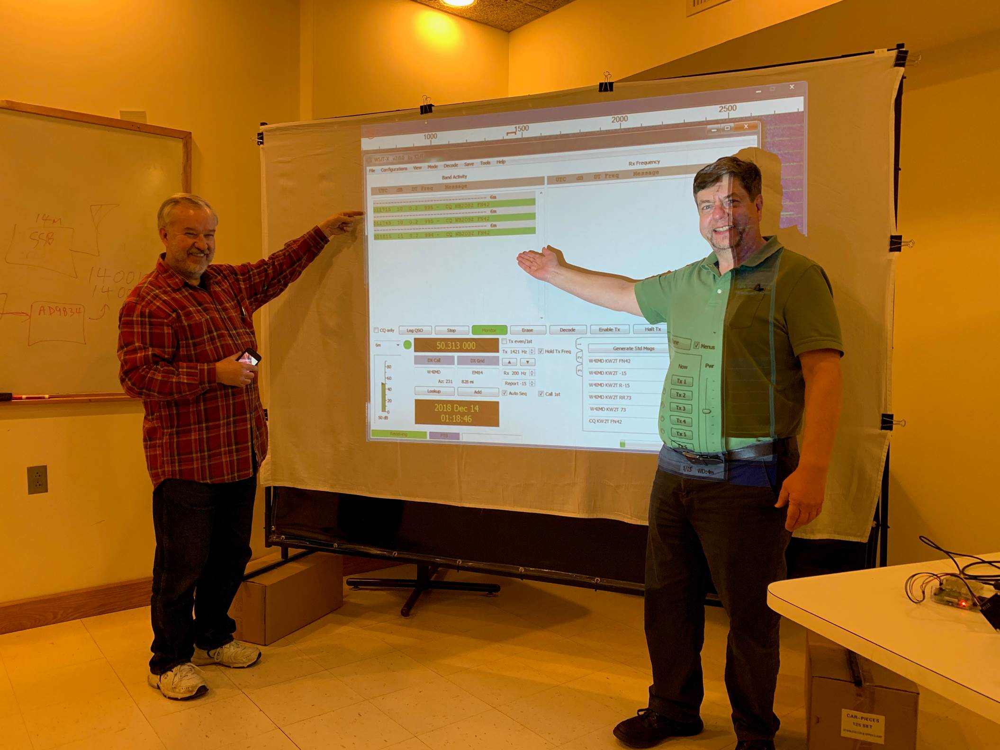
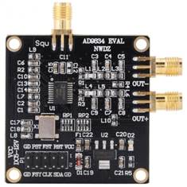

# TechNight Radio Project #

The goal of the [TechNight Radio Project](http://www.danstechnight.com/RadioProject.html) is to design and build a simple, low cost, low power, yet high quality single band ham transceiver.  

One of the requirements is the ability to use FT-8 and the other [WSJT-X](http://physics.princeton.edu/pulsar/k1jt/) modes.  This is complicated by the fact that there will be no SSB transmit capability.  The normal way of transmitting FT-8, etc., is to generate audio and feed it into an SSB transmitter.  The transmitter simply shifts the audio tones up into the RF range.

Instead we will be using direct digital synthesis (DDS) chips to generate the radio frequency directly.  How can we extract the necessary information from WSJT-X and command a DDS chip to generate equivalent tones?

The first part of this is a Proof of Concept to demonstrate that it is possible.  This can be found in the [poc](poc) subdirectory.  

Later, a more complete radio virtual front panel will be developed.

In the lower right corner, there is a Raspberry Pi running a modified version of WSJT-X.   it is connected to an AD9834 (direct digital synthesis) eval board acting as a transmitter.  No audio was involved at this end.

Across the room, we had the traditional transceiver and laptop for reception.   We were able to demonstrate the feasibility of this approach.  