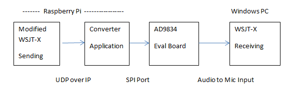

# Proof of Concept #

Normally WSJT-X transmits by generating tones which go thru an SSB transmitter.  We want to generate the RF directly without going thru audio first.

Is this possible?  Our initial goal is to conduct an experiment like this:

- A modified WSJT-X generates some sort of message at the beginning of each transmission.
- An application converts this message into commands for the AD9834 DDS chip.
- The DDS chip generates audio.
- Another instance of WSJT-X, on a different computer, decodes the audio.

In this directory you should find:

-  Files from WSJT-X which were modified:
-- Modulator.cpp
-- Modulator.hpp
-- mainwindow.cpp
- wsjtx - 2.0-RC3 version built with two files above for the Raspberry Pi 3.  If you don't want to go thru all the trouble of building your own from source, you can do a normal install of the [.deb package](http://physics.princeton.edu/pulsar/K1JT/wsjtx_2.0.0-rc3_armhf.deb) then replace just this one file in /usr/local/bin.
- AD9834.cpp & AD9834.h - Interface to the AD9834 DDS chip over the SPI bus.
- dds.cpp - Converts messages from modified WSJT-X into commands for the DDS chip.
- WSJT-X-Transmit-with-DDS.docx - Journal of the adventure.
- and more ...

By adding the RF (suppressed) carrier to the frequency generated we go directly to a radio signal without any audio along the way.  This was demonstrated at one of our meetings.

On one side of the room was a Raspberry Pi running a modified WSJT-X and driving a DDS chip.  A short wire served as antenna.

On the other side of the room was a normal SSB transceiver and laptop.  We successfully received the signal being sent by the Raspberry Pi.